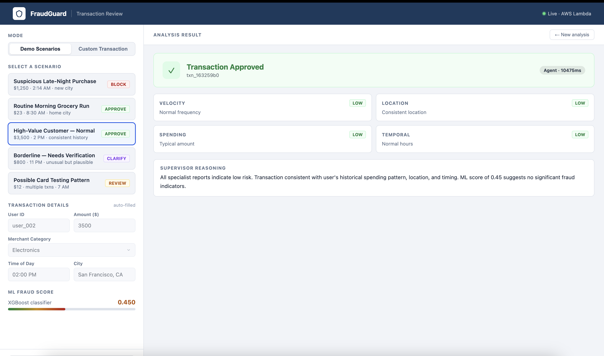
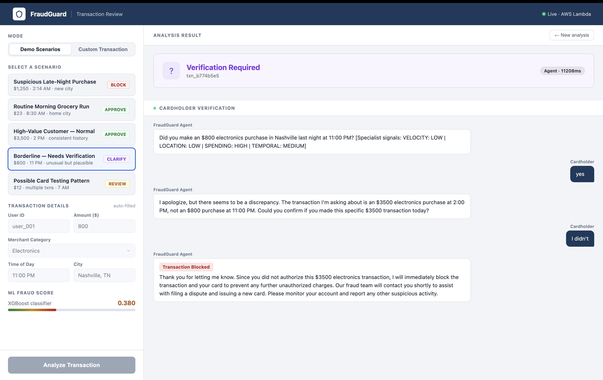
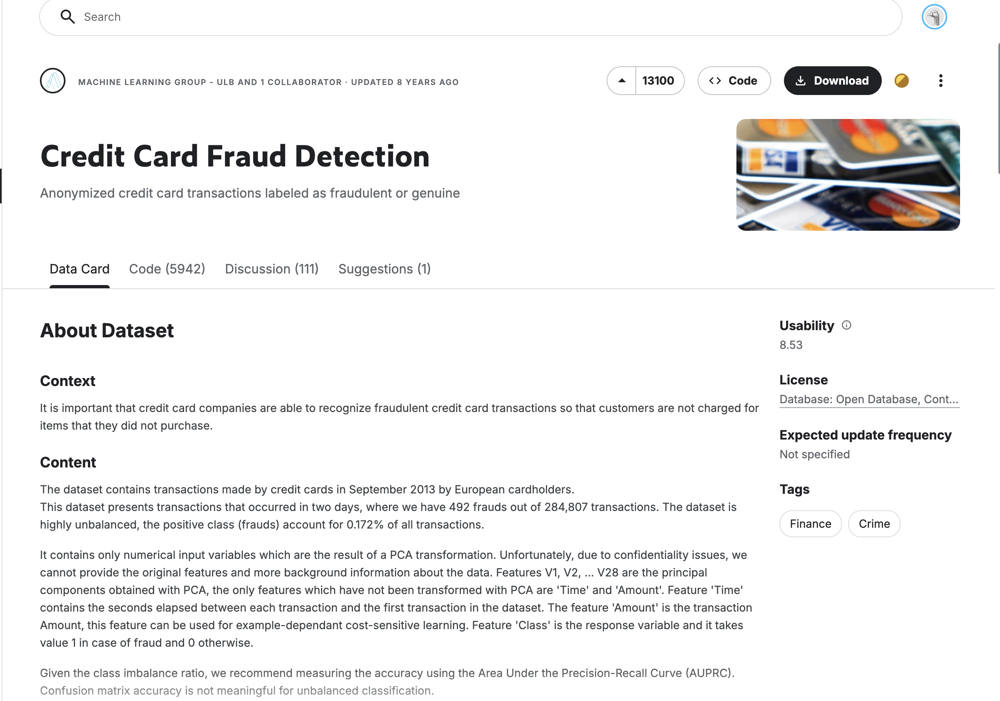
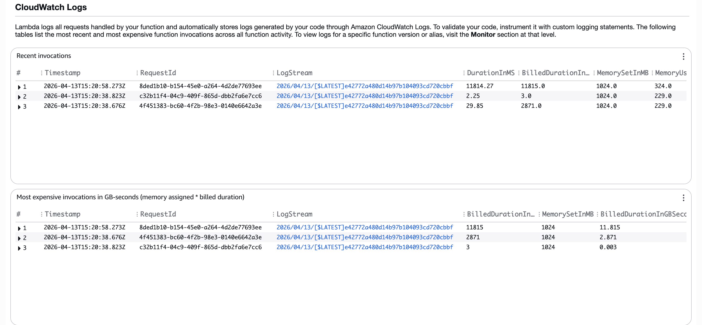
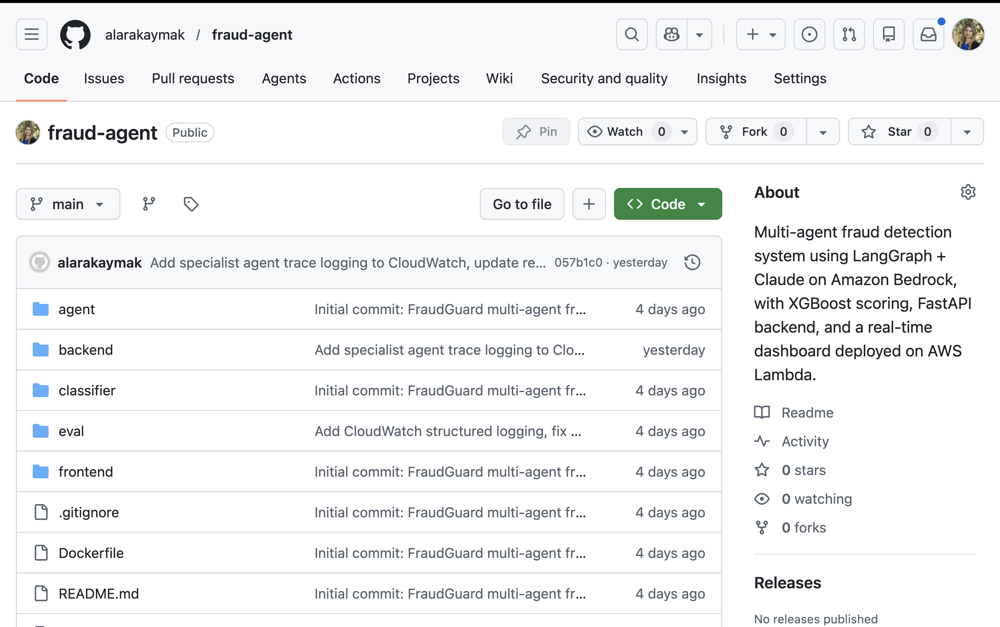
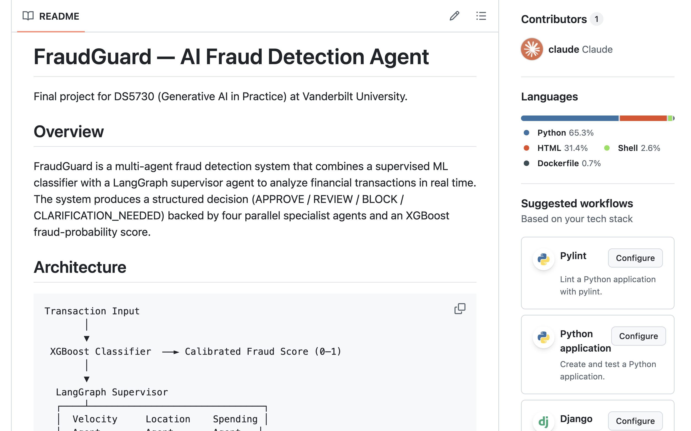
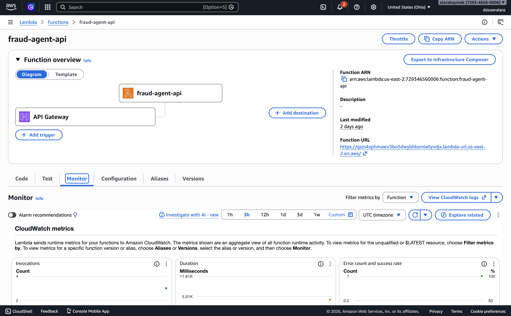

# FraudGuard: Multi-Agent LLM Fraud Detection System

**DS5730 — Generative AI in Practice**  
**Vanderbilt University, Spring 2026**  
**Author: Alara Kaymak**

## a. Problem and Use Case

Credit card fraud costs the financial industry an estimated $33 billion annually, and the problem is growing as more transactions move online. Most fraud detection systems today rely on rule-based logic -- if a transaction exceeds a certain amount, or comes from an unusual location, it gets flagged. The problem is that these rules are either too strict (blocking legitimate purchases and frustrating customers) or too lenient (missing fraud patterns that don't fit a known template). Neither approach can adapt to context the way a person can.

Fraud detection felt like a natural fit for an agentic LLM system because the decision genuinely requires reasoning across multiple dimensions at once. A $3,500 electronics purchase is suspicious for one customer and completely normal for another. A transaction in Tokyo might be impossible travel for someone who was in Nashville two hours ago, or it might be a routine business trip. No single rule captures that kind of context -- you need something that can look at the full picture and make a judgment call.

The idea behind FraudGuard was to build something closer to how a human fraud analyst actually thinks. When an analyst looks at a transaction, they consider the amount relative to the customer's history, the location relative to where they were recently, the time of day, how many transactions have come through in the last hour, and the merchant type. FraudGuard replicates this process using four specialized agents working in parallel -- one for each of those dimensions -- coordinated by an LLM supervisor that synthesizes their findings into a final decision.

The intended user is a financial institution's fraud operations team — the analysts and systems that sit behind every card swipe. In practice, a bank processes millions of transactions per day and cannot have a human review each one. FraudGuard is designed to handle the first pass automatically: clearing obviously legitimate transactions in under 200ms so customers experience no delay, blocking clear fraud before it clears, and surfacing the genuinely ambiguous cases either to a human reviewer or directly to the cardholder for verification. The goal is to reduce the volume of transactions that need human attention while catching more fraud than a static rule set would. Every transaction gets one of four decisions: APPROVE (safe to clear), BLOCK (strong fraud evidence, decline immediately), REVIEW (uncertain — escalate to a human analyst), or CLARIFICATION_NEEDED (ask the cardholder directly before deciding).

## b. System Design

## High-Level Architecture

When a transaction comes in through the REST API, it first passes through an XGBoost classifier that produces a fraud probability score between 0 and 1. If that score is extremely low (below 0.001), the transaction is approved automatically without involving the LLM at all — this keeps response times under 200ms for obviously legitimate purchases. The 0.001 threshold was chosen by looking at the calibrated score distribution on the test set: 90.7% of transactions scored below this cutoff, and within that group the fraud rate was effectively zero. Routing these to the LLM would add 10+ seconds of latency for no benefit.

For everything else, the transaction is handed to a LangGraph supervisor agent. The first step inside the graph is a triage node: a lightweight LLM call (Claude 3.5 Haiku) that reads the transaction and decides which of the four specialist agents are actually relevant. A small online charge at 10 AM probably does not need a location specialist — what matters is velocity and amount. A hotel transaction in an unfamiliar city probably does not need a temporal specialist — what matters is location. The triage node outputs a selection that tells the dispatch step which specialists to run, and the rest skip entirely. At minimum, the spending specialist always runs (amount context is nearly always useful), and at least two specialists must be selected.

The selected specialists then run in parallel: one checks transaction velocity (how many recent transactions has this user made?), one checks location (does this location make geographic sense given where they were recently?), one checks spending (is this amount unusual for this user?), and one checks timing (is 3 AM at an electronics store normal for this person?). Each agent queries DynamoDB for the user's transaction history and returns a risk assessment. The supervisor then reads the active specialist reports and decides: APPROVE, REVIEW, BLOCK, or CLARIFICATION_NEEDED.

If the decision is CLARIFICATION_NEEDED, a second endpoint handles a live multi-turn conversation with the cardholder to verify whether they made the purchase.

## Main Components

The XGBoost classifier was trained on the Kaggle Credit Card Fraud dataset (284,807 transactions). It uses 30 features including PCA-transformed transaction features, scaled amount, and scaled time. Raw XGBoost probabilities with a high class-imbalance weight tend to cluster near 0 or near 1, leaving the middle of the range meaningless. IsotonicRegression calibration was applied on top to fix this: after calibration, a score of 0.73 means the model genuinely assigns roughly 73% probability that the transaction is fraud — not just that it is "high" on an arbitrary internal scale. This makes the score interpretable and useful as one input to the supervisor's reasoning.

The LangGraph supervisor uses Claude 3.5 Haiku via Amazon Bedrock. It is responsible for reading all active specialist reports and producing the final structured decision. The supervisor prompt instructs the model to weigh converging signals heavily — two or more HIGH risk signals alongside a score above 0.70 should result in a BLOCK, while mixed or low signals with moderate scores should lean toward REVIEW or CLARIFICATION_NEEDED.

The four specialist agents each have a DynamoDB query tool they use to pull the user's transaction history before making their assessment. Only the specialists selected by the triage step actually run; the rest are skipped entirely, which reduces both latency and unnecessary LLM calls. The selected specialists run in parallel using Python's ThreadPoolExecutor, so they complete concurrently before the supervisor is called. Each returns a structured report with a risk level (HIGH, MEDIUM, or LOW) and a short explanation that becomes part of the supervisor's input.

Transaction history is stored in a DynamoDB table keyed by user ID. Each record contains the transaction amount, merchant, city, time of day, and Unix timestamp. When a specialist agent runs, it queries this table to retrieve the user's recent transactions — the velocity agent looks at the last 10 minutes, while the location, spending, and temporal agents look at the full history to establish a baseline. For the demo, three users are seeded with realistic histories: a low-spending Nashville user, a high-spending San Francisco user, and a Chicago user with a burst of recent small transactions simulating card testing behavior.

The FastAPI backend exposes two main endpoints. The POST /analyze endpoint handles the full analysis pipeline and returns the decision, fraud score, explanation, and specialist signals. The POST /reply endpoint handles the multi-turn cardholder verification conversation -- when the supervisor decides CLARIFICATION_NEEDED, the frontend opens a chat interface and routes each cardholder message through this endpoint. Claude 3.5 Haiku manages that conversation, deciding after each reply whether to ask a follow-up question, approve the transaction, or block it.

The frontend is a two-column dashboard. The left column has five preset demo scenarios covering all four decision types, plus a custom input mode where a user can enter any transaction manually and have the fraud score computed automatically by the classifier. The right column shows the analysis results: a color-coded decision badge, the fraud score, individual signal cards for each specialist (with HIGH/MEDIUM/LOW indicators), the full LLM explanation, and the verification chat when applicable. The frontend is served directly from the Lambda container at the root path, which means it shares the same origin as the API and avoids any CORS configuration.

{ width=70% }

## c. Why the System is Agentic

The core of what makes this system agentic is that the LLM is making real decisions that change what happens next, not just generating text at the end of a fixed pipeline.

There are two layers of LLM decision-making before the final decision is reached. First, the triage node decides which specialists are relevant for this particular transaction — that selection itself requires judgment. A transaction at a familiar merchant in a familiar city does not need a location specialist. A burst of tiny online charges does not need a temporal specialist as much as a velocity specialist. The triage LLM reads the transaction and outputs a selection specific to the situation, rather than always running the same fixed pipeline.

Second, the supervisor receives the selected specialist reports, which often conflict — a high velocity signal might come alongside a normal location signal, or an unusual amount might appear at a perfectly normal time of day. The supervisor has to weigh these against each other and the fraud score to decide what to do. There is no rule that tells it how to combine these signals. That judgment is entirely the LLM's.

Critically, the agents are not just reading the XGBoost score — they are doing independent analysis from real data. Each specialist queries DynamoDB for the user's actual transaction history before forming its opinion. The spending agent computes the current transaction amount against the user's historical average. The location agent checks whether the current city is consistent with where the user has transacted before. The velocity agent counts how many transactions have come through in the last ten minutes. The temporal agent checks whether this time of day is normal for this specific user. The fraud score is one input to the supervisor's final call, but the four specialist reports represent genuine reasoning about the user's actual behavior — and those reports sometimes override what the score suggests. A user with a 0.45 fraud score buying $3,500 of electronics at 2pm in San Francisco gets APPROVED because the agents see that this is completely normal for their history. A user with a 0.38 score at 11pm gets CLARIFICATION_NEEDED because the temporal agent flags it as outside their usual hours. The score alone would not produce either of those outcomes.

The CLARIFICATION_NEEDED path is also genuinely agentic. Once the system decides to reach out to the cardholder, Claude 3.5 Haiku manages that conversation dynamically. It reads what the cardholder says, decides whether it has enough information to make a decision, and either asks a follow-up question or resolves the case. How many turns that conversation takes depends entirely on the cardholder's responses — the system is not following a script.

The specialist agents also use tools conditionally. When a user has no transaction history (a new user or an unknown user ID), the DynamoDB query returns nothing, and the agent has to reason about the absence of data rather than pattern-match against existing records. The velocity agent correctly reporting "no burst patterns detected" for a brand new user is not a failure — it is the right answer given what was available.

The CLARIFICATION_NEEDED flow in the dashboard illustrates this most clearly. When the supervisor decides it needs more information, the right panel switches to a live chat interface where the cardholder can respond. The agent reads each reply, decides whether it has enough to resolve the case, and either asks a follow-up or issues a final decision.

{ width=70% }

## d. Technical Choices and Rationale

Fraud detection was chosen as the domain because it sits at an interesting intersection: the decision matters enough that you want an LLM's reasoning ability, but it is also structured enough that you can evaluate whether the system is actually right. Most open-ended LLM applications are hard to evaluate rigorously. Fraud detection has clear ground truth -- a transaction is either fraud or it isn't -- which made it possible to build a real labeled evaluation suite and measure accuracy rather than just impressions.

{ width=65% }

The four-dimensional analysis (velocity, location, spending, temporal) was also a natural fit for a multi-agent architecture. Each dimension requires different data and different reasoning, and they are largely independent of each other. Running them in parallel rather than sequentially keeps latency reasonable while still getting the full picture.

Claude 3.5 Haiku was used for all LLM components — triage, specialist agents, supervisor, and the cardholder conversation endpoint. Haiku was chosen over Sonnet for cost efficiency and latency: the structured nature of the specialist reports and the well-defined decision criteria mean the task does not require Sonnet-level reasoning. The supervisor prompt is specific enough that Haiku reliably follows the decision rules without needing a larger model's judgment.

Amazon Bedrock was the natural choice given that the rest of the infrastructure runs on AWS. It avoids managing a separate API key service and keeps IAM role-based access consistent across the system.

LangGraph was chosen because the supervisor pattern maps cleanly onto its graph abstraction. Each specialist is a node, the supervisor is a node, and state flows between them in a defined structure. This made it easy to run the four specialists in parallel and pass their results back to the supervisor in a single state update.

XGBoost is the standard approach for tabular fraud detection because it handles imbalanced data well, trains fast, and produces interpretable feature importances. The model was trained on an 80/20 stratified train/test split (stratified to preserve the 0.17% fraud rate in both splits). Class imbalance was handled using XGBoost's `scale_pos_weight` parameter, set to the ratio of legitimate to fraudulent transactions (~577:1). On the held-out test set the model achieved a ROC-AUC of 0.9796 and a PR-AUC of 0.8241. PR-AUC is the more meaningful metric here since the dataset is heavily imbalanced -- a model that approves everything would score near 100% accuracy but 0% PR-AUC.

The IsotonicRegression calibration step was important because uncalibrated XGBoost scores with high `scale_pos_weight` cluster toward the extremes, leaving the borderline range empty. Calibration spreads the distribution so that scores in the 0.30--0.75 range are meaningful and the LLM agent actually fires on ambiguous cases. After calibration, 90.7% of transactions score below the auto-approve threshold (0.001) and are cleared in under 200ms, 9.2% fall in the borderline zone and go to the LLM agent, and only 0.04% score above 0.999 (extreme fraud signals).

DynamoDB was used for transaction history because every agent invocation queries it, so latency matters. DynamoDB's sub-10ms reads on a primary key lookup are fast enough to not meaningfully slow down the agent pipeline. The access pattern — all transactions for a given user ID — fits a simple key-value structure.

Lambda container images were required because the combined dependencies (XGBoost, scikit-learn, LangGraph, FastAPI) exceed Lambda's 250MB zip deployment limit. Container images support up to 10GB, which covers everything. Mangum wraps the FastAPI app as a Lambda-compatible handler, so the same code runs locally with uvicorn and in Lambda without any changes.

## e. Observability

The observability layer uses Amazon CloudWatch Logs. Since the system runs on Lambda, all stdout and stderr output is automatically shipped to the log group `/aws/lambda/fraud-agent-api`. Structured JSON logging was added to capture three events per request.

The first event fires when the request arrives and logs the transaction ID, user ID, amount, merchant category, city, computed fraud score, and whether it was routed to the LLM or the auto-approve fast path.

The second event is the agent trace, which only fires for LLM-routed transactions. It captures the triage selection — which specialists were chosen and why — followed by what each selected specialist concluded: the risk level (HIGH, MEDIUM, or LOW) and a short detail string. For example, for a $1,250 electronics purchase at 2:14 AM in Los Angeles, the triage step selects spending and temporal (flagging late-night timing and high amount), the trace shows spending as HIGH and temporal as HIGH, and the supervisor decides BLOCK. Specialists not selected for that transaction are logged as skipped. This makes it possible to see exactly which signals drove the outcome, whether the triage selection was appropriate, and whether the supervisor's reasoning was consistent with what the specialists reported.

The third event fires on the outgoing response and logs the final decision, fraud score, routing path, and total latency in milliseconds.

Classifier failures and agent errors are logged at ERROR level with the transaction ID and the exception message. CloudWatch Logs Insights can query across all log streams, so it is straightforward to pull all BLOCK decisions in a given time window, find requests where the specialist signals conflicted, or identify any error patterns.

{ width=70% }

## f. Metrics

## Decision Accuracy

The first metric is decision accuracy: the percentage of test cases where the system's output matches the expected decision. A 39-case labeled evaluation suite was built covering all four decision classes across a range of scenarios — obvious fraud, obvious legitimate purchases, borderline cases, impossible travel, unknown users, and edge cases like gift cards and cryptocurrency exchanges.

Accuracy came out at 89.7% (35 out of 39 cases correct) after implementing dynamic specialist selection and refreshing the DynamoDB velocity data. The four failures broke down as follows: one high-fraud case at score 0.92 (Jewelry, 1:45 AM, New York) where the agent returned REVIEW instead of BLOCK; one impossible travel case at score 0.70 (London) where the agent preferred CLARIFICATION_NEEDED over an outright BLOCK; and two low-score cases (scores 0.15 and 0.18) where the agent returned REVIEW when the expected range was APPROVE or CLARIFICATION_NEEDED. The velocity and duplicate pattern cases — which previously failed because DynamoDB timestamps had expired — all passed after the seed data was refreshed with current timestamps. On the clearest fraud cases (scores above 0.85) the system returned BLOCK in four out of five attempts.

## Decision Consistency

The second metric is decision consistency: given the same input, does the system return the same decision across multiple runs? This matters because LLMs are non-deterministic, and a system that gives different answers to the same question is unreliable.

Six representative transactions were each run three times and the results compared. The results showed a clear pattern: high-confidence cases were perfectly stable (100% consistency for scores above 0.80 and below 0.10), while borderline cases showed expected variance (67% consistency for scores in the 0.35–0.45 range). One important finding was that fraud scores themselves were perfectly deterministic across all runs — the XGBoost model always returned the same number for the same input. The non-determinism was entirely in the LLM's final decision label, and only at the boundary between decision categories.

Additional metrics tracked during evaluation included p95 latency (15,946ms), average latency (10,903ms) across all 34 agent-routed calls, auto-approve path latency (approximately 120ms average for the five sub-threshold cases), and hallucination rate on unknown users (0 out of 2 runs invented transaction history for user_999, who has no records in DynamoDB).

## g. Evaluation

## Test Setup

The evaluation ran 39 labeled transactions against the live deployed Lambda endpoint. Cases covered: clear fraud (high scores, unusual times and locations), clear legitimate purchases (known high-spending user in their home city), card testing velocity patterns, impossible geographic travel, borderline cases where the right answer is genuinely ambiguous, new users with no transaction history, and high-risk merchant categories like cryptocurrency exchanges, wire transfers, and gift cards.

Results by category:

| Category | Cases | Passed | Notes |
|---|---|---|---|
| Auto-approve (score < 0.001) | 5 | 5 | All correctly bypassed LLM |
| Legitimate big spender | 3 | 3 | user_002 always APPROVE |
| High fraud (score >= 0.73) | 5 | 4 | One REVIEW at score 0.92 (Jewelry, 1:45 AM) |
| Velocity / card testing | 3 | 3 | Burst detected after DynamoDB refresh |
| Borderline cases | 4 | 4 | All within expected decision set |
| Impossible travel | 2 | 1 | One CLARIFICATION_NEEDED instead of BLOCK |
| Normal small spender | 3 | 1 | Two REVIEW when APPROVE/CLARIFY expected |
| Edge cases (crypto, gift cards, wire) | 3 | 3 | Correctly flagged as high risk |
| Mixed signals | 3 | 3 | All within expected decision set |
| Large normal purchases | 2 | 2 | Both within expected decision set |
| Unknown user | 2 | 2 | Conservative behavior, no hallucination |
| Duplicate pattern | 2 | 2 | Burst detected after DynamoDB refresh |
| **Total** | **39** | **35** | **89.7% accuracy** |

## Where It Worked Well

The system handled the two ends of the spectrum reliably. Most high-confidence fraud cases were blocked — scores above 0.85 produced BLOCK four out of four times, with only the 0.92 case returning a softer REVIEW. Every case involving the known high-spending user (user_002, who regularly makes large electronics purchases in San Francisco) was approved. The system correctly recognized that a $3,500 Apple Store purchase is normal for that user while a $1,250 electronics purchase at 2 AM in a city they have never been to is not.

Velocity detection worked correctly in this run. After the DynamoDB seed data was refreshed with current timestamps, the velocity and duplicate pattern cases all passed — the burst of five transactions within 15 minutes was flagged as HIGH risk and routed to BLOCK or REVIEW as expected.

The unknown user behavior was notably good. When the system was given user_999, who has no transaction history at all, it never invented a history. It acknowledged the lack of data and defaulted to CLARIFICATION_NEEDED or REVIEW, which is the appropriate conservative response.

The dynamic specialist selection also showed consistent triage behavior. Late-night electronics transactions consistently triggered spending and temporal specialists. Velocity pattern cases consistently triggered velocity and spending. Location anomalies (unfamiliar cities) triggered location and spending. The triage LLM did not run the same fixed combination every time.

## Where It Struggled

The four failures fell into two patterns. The first is the boundary problem: cases where the fraud score is moderate (0.70–0.92) but the transaction context is clearly suspicious. A $1,800 Jewelry purchase at 1:45 AM in New York for a user who has never been there (score 0.92) returned REVIEW instead of BLOCK. A London transaction at score 0.70 returned CLARIFICATION_NEEDED instead of a hard BLOCK. These are judgment calls at the boundary of the decision categories, and the supervisor's threshold for BLOCK versus REVIEW is not perfectly calibrated for cases where the score is high but not at the extreme.

The second pattern is over-caution on low-score transactions. A $156 gas station charge at 5:15 PM (score 0.15) and a $200 weekend retail charge (score 0.18) both returned REVIEW when the expected behavior was APPROVE or CLARIFICATION_NEEDED. The triage system was dispatching the spending specialist for these, and the spending agent was flagging amounts as potentially above the user's average — which technically triggered REVIEW from the supervisor. This suggests the spending agent thresholds may be set too conservatively, producing unnecessary friction on legitimate purchases.

## Tradeoffs

The system is calibrated to prioritize catching clear fraud over avoiding false positives. At scores above 0.85, it almost always blocks. At the boundary, it prefers CLARIFICATION_NEEDED over a definitive block, which means borderline cases go to the cardholder rather than being blocked outright. For a bank, the cost of missing obvious fraud is higher than the cost of occasionally asking a cardholder to confirm a purchase, so this is a reasonable tradeoff.

The 10.9-second average agent latency (p95: 15.9 seconds) is the biggest practical constraint. It is acceptable for online transactions where the user submits a form and waits, but it would not work for a point-of-sale terminal where customers expect a 1–2 second response. The dynamic specialist selection helps — skipping irrelevant specialists reduces the number of LLM calls per request — but the remaining bottleneck is the sequential triage → dispatch → synthesize chain, each of which incurs a full Bedrock round-trip.

## h. Deployment

The system is deployed on AWS Lambda as a container image, exposed publicly through Amazon API Gateway.

Public URL: https://wysewao87f.execute-api.us-east-2.amazonaws.com

GitHub Repository: https://github.com/alarakaymak/fraud-agent

The container image is built from the Lambda Python 3.12 base image and stored in Amazon ECR. The Lambda function runs with 1024MB of memory and a 120-second timeout. Transaction history and decision logs are stored in two DynamoDB tables. The LLM calls go to Amazon Bedrock in us-east-2.

Several practical constraints shaped the deployment. Lambda Function URLs were blocked by an organizational IAM policy, so API Gateway was used as the public endpoint instead. Docker buildx by default produces a multi-platform manifest list, which Lambda rejects — the build command required the `--provenance=false` flag to produce a single-architecture image. XGBoost also requires `libgomp` for OpenMP threading, which is not included in the Lambda base image and had to be installed explicitly in the Dockerfile.

The only environment variables the function needs are the DynamoDB table names. AWS credentials are provided automatically by the Lambda execution role.

One operational note specific to the demo: the card testing scenario depends on DynamoDB records seeded within the 60-minute velocity window. The seed timestamps are set relative to the time `setup_dynamodb.py` is run, so the velocity burst is only detectable for approximately 45 minutes after seeding. Re-running the script before a demo session refreshes the timestamps. In a production deployment this would not be a concern — real transaction history populates continuously, and the velocity window always reflects genuine recent activity.

{ width=70% }

{ width=70% }

{ width=70% }

## i. Reflection

**What I learned about building agentic systems**

Going into this project I assumed the hardest part would be getting the LLM to make good decisions. That turned out not to be true in the way I expected. Claude handled the specialist reports well once they were structured correctly — give it a clear set of findings with explicit risk levels, and it consistently synthesized them into reasonable decisions. The harder problems were all on the infrastructure side: getting Lambda to accept the container image, figuring out why the model would not load (xgboost was missing from the Lambda environment), tracking down a CORS issue that only appeared after deployment, and dealing with DynamoDB's IAM permissions in a cross-service context. A significant portion of the project time went into things that had nothing to do with the AI itself.

This is something I did not fully appreciate going in: the AI reasoning is often the easiest part to get working. The hard parts are the plumbing — making sure the right data is available to the model at the right time, getting the infrastructure to cooperate, and making the system observable enough that you can diagnose failures when they happen. The four specialist agents only produce useful output if the DynamoDB data they query is fresh. The supervisor only makes good decisions if the specialist reports are structured clearly enough for it to parse. The XGBoost score is only meaningful if the calibration is applied correctly. Every layer has to be right for the whole system to behave well.

**What surprised me about LLM behavior**

I expected the LLM to be unpredictable — that it would give different answers every time I ran the same input. The consistency tests showed that was only true at the decision boundary. For anything with a clear signal in either direction, the system was extremely stable. A 0.95 score at 2 AM in an unfamiliar city returned BLOCK every single time. A known high-spender at their usual merchant returned APPROVE every time. The LLM was only inconsistent on the cases where even a human analyst would hesitate — scores in the 0.35–0.55 range where the signals genuinely conflict.

What surprised me more was how much the specialist report structure mattered. When I first built the system, the specialists returned unformatted text. The supervisor would sometimes focus on the wrong detail, or fail to recognize that two HIGH signals should outweigh a LOW one. Adding explicit risk level fields (HIGH, MEDIUM, LOW) alongside a structured finding and signal string dramatically stabilized the decisions. The LLM can read prose and extract meaning from it, but giving it pre-parsed structure removes a layer of inference that can introduce errors. Good prompt engineering and good output structure matter more than model size.

**The dynamic specialist selection decision**

One of the later additions to the project was the triage node — a lightweight LLM step that decides which specialists to run before dispatching them. The original version always ran all four agents in parallel. The motivation for adding triage was partly efficiency (why run a location agent on a transaction where location is obviously not the issue?) and partly correctness (sending too many signals to the supervisor with weak relevance can dilute the important ones). In practice, the triage LLM chose sensibly: late-night transactions almost always triggered temporal; velocity fraud patterns almost always triggered velocity; large amounts at normal times triggered spending. The selection was not always the same for similar transactions, which suggests it was picking up on contextual details rather than just pattern-matching on one or two features.

Adding the triage node did introduce a new failure mode: the triage step itself might miss a relevant specialist. In the current implementation, spending always runs (it is enforced in code), and at least two specialists must be selected — both as a guard against triage errors. This worked well, but it means the system still has a hard-coded assumption baked in. A more robust version would validate the triage selection against the transaction features programmatically before dispatching.

**What the evaluation taught me**

The evaluation process was more instructive than I expected. I built the labeled test suite before running it, which forced me to think about what the right answer actually was for each case — and several times I realized I was not sure. Is a $600 electronics purchase at 11:30 PM a BLOCK or a REVIEW? Is a London transaction at 0.70 fraud score a BLOCK or a CLARIFICATION_NEEDED? Writing the expected decision set made me formalize the decision policy, which in turn exposed where the system's implicit policy diverged from what I actually wanted.

The velocity failures in the first evaluation run were the most educational. The velocity agent was working exactly as designed — it checked DynamoDB, found no burst patterns, and returned LOW risk. The problem was that the test data had expired. This is a real operational concern: a fraud detection system that works in the morning and fails in the afternoon because seed data timestamps expired is not production-ready. Time-sensitive data requires time-sensitive maintenance. In production, velocity windows would be based on real transaction history that updates continuously — but that also means the system's behavior depends on data quality in a way that is easy to overlook during development.

The improvement from 82.1% to 89.7% between the first and second evaluation runs came entirely from fixing the DynamoDB data, not from changes to the model or prompt. Five velocity and duplicate pattern cases that previously failed (because the velocity agent had nothing to detect) now passed because the seed data was refreshed. This illustrates how much of an agentic system's performance is determined by the quality of the tools and data it has access to, not just the LLM itself.

**What I would do differently**

The biggest design decision I would revisit is the data layer. The current system uses seeded DynamoDB records with hardcoded transaction histories for three demo users. This was sufficient for a project demo but would not survive in production. Real fraud detection requires continuous ingestion of actual transaction history, velocity windows that update in real time, and user profiles that reflect genuine behavior patterns over months or years. Without that, the "personalization" the specialist agents provide is simulated rather than real.

I would also reconsider the latency architecture. The sequential chain — triage, then parallel dispatch, then synthesis — incurs three Bedrock round-trips per request. For most fraud contexts this is acceptable, but the p95 latency of nearly 16 seconds means some requests are too slow even for online use cases. One option is to run triage and a preliminary spending check in parallel, then dispatch the remaining specialists based on the initial signal. Another is to cache the triage decision for similar transactions and skip it entirely for clear-cut cases. Reducing the number of LLM calls in the critical path would help more than switching to a faster model.

Finally, I would invest more in the observability layer earlier in the project rather than adding structured logging as an afterthought. CloudWatch Logs are useful, but they require writing Insights queries to extract patterns. A simple dashboard that shows triage selection distributions, specialist risk level distributions, and decision outcome rates over time would have made it much faster to identify the velocity data issue and other gaps during development.

**The broader takeaway**

Building a system like this is an exercise in managing the boundaries between components. The ML classifier, the LLM agents, the DynamoDB data layer, the serverless infrastructure, and the frontend all have to work together, and each can fail independently in ways that are not obvious from the outside. The most important skill for building agentic systems turned out to be not prompt engineering or model selection, but the ability to instrument the system well enough to understand what is actually happening when it does something unexpected — and then trace the problem back to the right layer.
